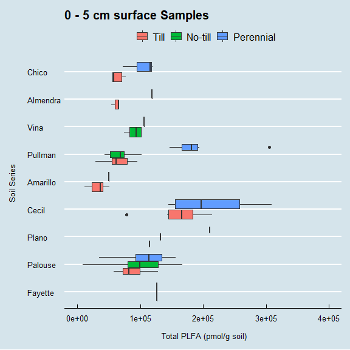

#PLFA and KSSL measures for DSP4SH
###Preliminary Analysis


## Data Prep


```r
PLFA <- read_excel("PLFA_summary_table_2019.xlsx", sheet = "PLFA_samples") 

LAB <- read_excel("Q_DSP4SH_project_analyte.xlsx", sheet = "Q_DSP4SH_project_analyte")

pedon <- read_excel("Pedons.xlsx", sheet = "Pedons")


plfas <- full_join(PLFA, pedon, by = "DSP_pedon") %>%
  filter(grepl('0-5|0_5|-A-|1-1-1', ID_Only)) %>%
  gather( key = "Property", value = "value", - c(ID_Only, DSP_pedon, PLFA_ID_Surface, LU:Texture_Class), factor_key = TRUE) %>%
  mutate(value = as.numeric(value),
         LU = toupper(LU), 
         till = fct_relevel(as.factor(till), "Till", "No-till", "Perennial")) 


labs <- full_join(LAB,pedon, by = "DSP_pedon") %>%  
  filter(lay_depth_to_top == 0) %>%
  select(-c(lab_proj_name, user_pedon_id, PLFA_ID, lay_field_label1:lay_field_label3, lay_depth_to_top, lay_depth_to_bottom, `ADOD-Ratio, Air-dry/Ovendry`, PLFA_ID_Surface)) %>%
  gather( key = "Property", value = "value", - c(State.x:horizon_designation, LU:Texture_Class), factor_key = TRUE)%>%
  mutate(value = as.numeric(value),
         LU = toupper(LU), 
         till = fct_relevel(as.factor(till), "Till", "No-till", "Perennial")) 
```

##Surface graphs

### PLFA graphs


```r
plfa_surf<- plfas %>% filter(Property != 'Total PLFA (pmol/g soil)') %>%
  filter(Property != '# PLFAs') %>%
  ggplot(aes(x = Property, y = value)) +   
  geom_boxplot() + coord_flip() + ylim(c(0,100000)) +
  #facet_wrap(~Project, ncol=2) +
  theme_economist() +  facet_wrap_paginate(~Soil, nrow = NULL, ncol = 2,
  scales = "fixed", shrink = TRUE, labeller = "label_value",
  as.table = TRUE, switch = NULL, drop = TRUE, dir = "h",
  strip.position = "top", page = 1) +
  labs(y = '' , x = ' \n', title = 'Surface Sample (0-5cm) PLFA')

plfa_surf
```

```
## Warning: Removed 4 rows containing non-finite values (stat_boxplot).
```

<!-- -->

```r
ggsave('plfa_surf.png',  plot = plfa_surf, device = "png", scale = 1, width = 6, height =  12, units = "in", dpi = 600, limitsize = TRUE)
```

```
## Warning: Removed 4 rows containing non-finite values (stat_boxplot).
```

```r
plfa_lu <- plfas %>% filter(Property == 'Total PLFA (pmol/g soil)') %>%
  ggplot(aes(x = fct_reorder(Soil, Gen_MAT), y = value, fill=till)) +   
  geom_boxplot() + coord_flip() + ylim(c(0,400000)) +
  #facet_wrap(~Property, ncol = 3, scales = 'free') +
  theme_economist() +
  scale_x_discrete(labels = function(x)  str_wrap(x, width = 24)) +
  labs(y = ' \n Total PLFA (pmol/g soil)', x = 'Soil Series \n', fill = '')
  

plfa_state <- plfas %>% filter(Property == 'Total PLFA (pmol/g soil)') %>%
  ggplot(aes(x = fct_reorder(Soil, Gen_MAT), y = value, fill=State)) +   
  geom_boxplot() + coord_flip() + ylim(c(0,400000)) +
  #facet_wrap(~Property, ncol = 3, scales = 'free') +
  theme_economist() +
  scale_x_discrete(labels = function(x)  str_wrap(x, width = 24)) +
  labs(y = ' \n Total PLFA (pmol/g soil)', x = 'Soil Series \n', fill = '', title = '0 - 5 cm surface Samples')

plfa_till <- plfas %>% filter(Property == 'Total PLFA (pmol/g soil)') %>%
  ggplot(aes(x = fct_reorder(Soil, Gen_MAT), y = value, fill=till)) +   
  geom_boxplot(aes(fill =till)) + coord_flip() + ylim(c(0,400000)) +
  #facet_wrap(~Property, ncol = 3, scales = 'free') +
  theme_economist() +
  scale_x_discrete(labels = function(x)  str_wrap(x, width = 24)) +
  labs(y = ' \n Total PLFA (pmol/g soil)', x = 'Soil Series \n', fill = '', title = '0 - 5 cm surface Samples')


plfa_till
```

```
## Warning: Removed 1 rows containing non-finite values (stat_boxplot).
```

<!-- -->

```r
plfa_state
```

```
## Warning: Removed 1 rows containing non-finite values (stat_boxplot).
```

<!-- -->

```r
plfa_lu
```

```
## Warning: Removed 1 rows containing non-finite values (stat_boxplot).
```

<!-- -->

```r
ggsave('Surf_plfa_till.png',  plot = plfa_till, device = "png", scale = 1, width = 6, height =  4, units = "in", dpi = 600, limitsize = TRUE)
```

```
## Warning: Removed 1 rows containing non-finite values (stat_boxplot).
```

```r
ggsave('Surf_plfa_LU.png',  plot = plfa_lu, device = "png", scale = 1, width = 6, height =  4, units = "in", dpi = 600, limitsize = TRUE)
```

```
## Warning: Removed 1 rows containing non-finite values (stat_boxplot).
```

```r
ggsave('Surf_plfa_state.png',  plot = plfa_state, device = "png", scale = 1, width = 6, height =  4, units = "in", dpi = 600, limitsize = TRUE)
```

```
## Warning: Removed 1 rows containing non-finite values (stat_boxplot).
```

```r
plfa_LUall <- plfas %>% filter(Property == 'Total PLFA (pmol/g soil)') %>%
  ggplot(aes(x = LU, y = value)) +   
  geom_boxplot() +  ylim(c(0,400000)) +
  #facet_wrap(~Property, ncol = 3, scales = 'free') +
  theme_economist() +
  labs(y = 'Total PLFA (pmol/g soil)', x = 'Land Use', title = '0 - 5 cm surface Samples')

plfa_LUall  
```

```
## Warning: Removed 1 rows containing non-finite values (stat_boxplot).
```

<!-- -->

```r
ggsave('Surf_plfa_LU-ALL.png',  plot = plfa_LUall, device = "png", scale = 1, width = 6, height =  4, units = "in", dpi = 600, limitsize = TRUE)
```

```
## Warning: Removed 1 rows containing non-finite values (stat_boxplot).
```

```r
plfa_LUall <- plfas %>% filter(Property == 'Total PLFA (pmol/g soil)') %>%
  ggplot(aes(x = LU, y = value)) +   
  geom_boxplot(aes(fill = LU),guide=FALSE) +  ylim(c(0,400000)) +
  #facet_wrap(~Property, ncol = 3, scales = 'free') +
  theme_economist() +
  labs(y = 'Total PLFA (pmol/g soil) \n', x = 'Land Use', title = '0 - 5 cm surface Samples')
```

```
## Warning: Ignoring unknown parameters: guide
```

```r
plfa_LUall  
```

```
## Warning: Removed 1 rows containing non-finite values (stat_boxplot).
```

<!-- -->

```r
ggsave('Surf_plfa_LU-ALL.png',  plot = plfa_LUall, device = "png", scale = 1, width = 6, height =  4, units = "in", dpi = 600, limitsize = TRUE)
```

```
## Warning: Removed 1 rows containing non-finite values (stat_boxplot).
```

```r
plfa_SOIL <- plfas %>% filter(Property == 'Total PLFA (pmol/g soil)') %>%
  ggplot(aes(x = Soil, y = value)) +   
  geom_boxplot() +  ylim(c(0,400000)) +
  #facet_wrap(~Property, ncol = 3, scales = 'free') +
  theme_economist() +
  labs(y = 'Total PLFA (pmol/g soil) \n', x = 'Land Use', fill = '', title = '0 - 5 cm surface Samples')

plfa_SOIL 
```

```
## Warning: Removed 1 rows containing non-finite values (stat_boxplot).
```

<!-- -->

```r
ggsave('Surf_plfa_SOIL.png',  plot = plfa_SOIL, device = "png", scale = 1, width = 6, height =  4, units = "in", dpi = 600, limitsize = TRUE)
```

```
## Warning: Removed 1 rows containing non-finite values (stat_boxplot).
```


### KSSL graphs


```r
lab_surf <- labs %>% filter(Property %in% c( "ß-Glucosidase") ) %>%
  filter(!is.na(Soil)) %>%
  ggplot(aes(x = Project, y = value)) +   
  geom_boxplot(aes(fill = LU)) + 
  theme_economist() +
 facet_wrap(~Property, ncol = 2, scales = "free" ) +
  
  scale_x_discrete(labels = function(x)  str_wrap(x, width = 24)) +
  # facet_wrap_paginate(Project~Property, nrow = NULL, ncol = NULL,
  # scales = "free", shrink = TRUE, labeller = "label_value",
  # as.table = TRUE, switch = NULL, drop = TRUE, dir = "h",
  # strip.position = "top", page = 1) +
  labs(y = '' , x = ' \n', fill = ' ')

lab_surf
```

<!-- -->

```r
ggsave('lab_surf.png',  plot = lab_surf, device = "png", scale = 1, width = 6, height =  4, units = "in", dpi = 600, limitsize = TRUE)
 


lab_Soil <- labs %>% filter(Property %in% c("Water Stable Aggregates", "ß-Glucosidase", "POX_C", "Total Carbon" ) ) %>%
  filter(!is.na(Soil)) %>%
  ggplot(aes(x = Soil, y = value)) +   
  geom_boxplot(aes(fill = till)) + coord_flip() +
  facet_wrap(~Soil, ncol = 3, scales = 'free') +
  facet_wrap_paginate(~Property, nrow = NULL, ncol = NULL,
  scales = "free", shrink = FALSE, labeller = "label_value",
  as.table = TRUE, switch = NULL, drop = TRUE, dir = "h",
  strip.position = "top", page = 1) +
  theme_economist() +
  labs(y = '', x = ' ', fill = '', title = '0 - 5 cm surface Samples')

lab_Soil
```

```
## Warning: Removed 27 rows containing non-finite values (stat_boxplot).
```

<!-- -->

```r
lab_till <- labs %>% filter(Property %in% c("Water Stable Aggregates", "ß-Glucosidase", "POX_C", "Total Carbon" ) ) %>%
   filter(!is.na(Soil)) %>%
  ggplot(aes(x = till, y = value)) +   
  geom_boxplot(aes(fill = till)) + coord_flip() +
  facet_wrap(~Soil, ncol = 3, scales = 'free') +
  facet_wrap_paginate(~Property, nrow = NULL, ncol = NULL,
  scales = "free", shrink = FALSE, labeller = "label_value",
  as.table = TRUE, switch = NULL, drop = TRUE, dir = "h",
  strip.position = "top", page = 1) +
  theme_economist() +
  labs(y = '', x = '', fill = '',title = '0 - 5 cm surface Samples')


lab_state <- labs %>% filter(Property %in% c("Water Stable Aggregates", "ß-Glucosidase", "POX_C", "Total Carbon" ) ) %>%
   filter(!is.na(Soil)) %>%
  ggplot(aes(x = State.y, y = value)) +   
  geom_boxplot(aes(fill = State.y)) + coord_flip() +
  facet_wrap(~Soil, ncol = 3, scales = 'free') +
  facet_wrap_paginate(~Property, nrow = NULL, ncol = NULL,
  scales = "free", shrink = FALSE, labeller = "label_value",
  as.table = TRUE, switch = NULL, drop = TRUE, dir = "h",
  strip.position = "top", page = 1) +
  theme_economist() +
  labs(y = '', x = '', fill = '',title = '0 - 5 cm surface Samples')

lab_state
```

```
## Warning: Removed 27 rows containing non-finite values (stat_boxplot).
```

<!-- -->

```r
lab_till
```

```
## Warning: Removed 27 rows containing non-finite values (stat_boxplot).
```

<!-- -->

```r
ggsave('surf_lab_till.png',  plot = lab_till, device = "png", scale = 1, width = 6, height =  4, units = "in", dpi = 600, limitsize = TRUE)
```

```
## Warning: Removed 27 rows containing non-finite values (stat_boxplot).
```

```r
ggsave('surf_lab_state.png',  plot = lab_state, device = "png", scale = 1, width = 6, height =  4, units = "in", dpi = 600, limitsize = TRUE)
```

```
## Warning: Removed 27 rows containing non-finite values (stat_boxplot).
```

```r
ggsave('Surf_lab_SOIL.png',  plot = lab_Soil, device = "png", scale = 1, width = 6, height =  4, units = "in", dpi = 600, limitsize = TRUE)
```

```
## Warning: Removed 27 rows containing non-finite values (stat_boxplot).
```

```r
lab_lu_cecil <- labs %>% filter(Property %in% c("Water Stable Aggregates", "ß-Glucosidase", "POX_C", "Total Carbon" ) ) %>%
   filter(!is.na(Soil)) %>% filter(Soil == "Cecil")%>%
  ggplot(aes(x = LU, y = value)) +   
  geom_boxplot(aes(fill = LU)) + coord_flip() +
  facet_wrap(~Soil, ncol = 3, scales = 'free') +
  facet_wrap_paginate(~Property, nrow = NULL, ncol = NULL,
  scales = "free", shrink = FALSE, labeller = "label_value",
  as.table = TRUE, switch = NULL, drop = TRUE, dir = "h",
  strip.position = "top", page = 1) +
  theme_economist() +
  labs(y = '', x = '', fill = '',title = 'Cecil: 0 - 5 cm surface Samples')

lab_lu_cecil
```

<!-- -->

```r
ggsave('Surf_lab_Cecil.png',  plot = lab_lu_cecil, device = "png", scale = 1, width = 6, height =  4, units = "in", dpi = 600, limitsize = TRUE)

lab_state_cecil <- labs %>% filter(Property %in% c("Water Stable Aggregates", "ß-Glucosidase", "POX_C", "Total Carbon" ) ) %>%
   filter(!is.na(Soil)) %>% filter(Soil == "Cecil")%>%
  ggplot(aes(x = State.y, y = value)) +   
  geom_boxplot(aes(fill = State.y)) + coord_flip() +
  facet_wrap(~Soil, ncol = 3, scales = 'free') +
  facet_wrap_paginate(~Property, nrow = NULL, ncol = NULL,
  scales = "free", shrink = FALSE, labeller = "label_value",
  as.table = TRUE, switch = NULL, drop = TRUE, dir = "h",
  strip.position = "top", page = 1) +
  theme_economist() +
  labs(y = '', x = '', fill = '',title = 'Cecil: 0 - 5 cm surface Samples')

lab_lu_cecil
```

<!-- -->

```r
ggsave('Surf_state_Cecil.png',  plot = lab_state_cecil, device = "png", scale = 1, width = 6.5, height =  4, units = "in", dpi = 600, limitsize = TRUE)
```
