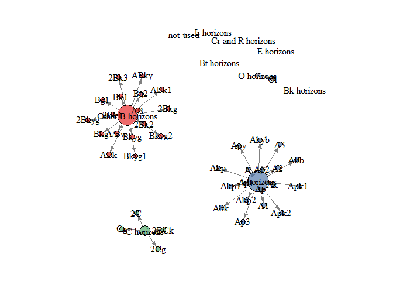

General Anlysis of DSP master data


Data import and prep


####Properties

__this stuff can probably be standardized__
Create standardized properties when multiple methods are used, such as bulk density
  -change rank of methods to alter the way multiple methods are analyzed
  -for this example core bulk density was favored because it was done on nearly all samples

```r
DSP %>%
  gather(key = "Property", value = "Value", -c(Name:Moist), Comp_layer) %>%
  left_join(
              dsp_labels %>% mutate(Property = Anal) %>% select(Property, Simple_explanation, Label) 
            ) %>%
  filter(!is.na(Value)) %>%
  select(Property) %>%
  filter(grepl("^BD", Property)) %>%
  group_by(Property) %>%
  count()
```

```
## Joining, by = "Property"
```

```
## Warning: package 'bindrcpp' was built under R version 3.4.4
```

```
## # A tibble: 10 x 2
## # Groups:   Property [10]
##    Property           n
##    <chr>          <int>
##  1 BD_clod_13       437
##  2 BD_clod_od       437
##  3 BD_compcav       376
##  4 BD_core_fld     1520
##  5 BD_fieldcore     101
##  6 BD_recon_moist   679
##  7 BD_recon_od      679
##  8 BD_recon13       679
##  9 BD_whole_moist   906
## 10 BD_wholesoil      80
```

```r
#Order of bulk density selection - change order if desired
bd_1 <- "BD_core_fld"
bd_2 <- "BD_fieldcore"
bd_3 <- "BD_clod_13"
bd_4 <- "BD_compcav"
bd_5 <- "BD_recon13"
bd_6 <- "BD_recon_moist"
bd_7 <- "BD_whole_moist"
```

####Data Prep
------------------

```r
#Currently the columns are ID'd directly - eventually these should be changeable

##################
# # #check that BD assignments are correct
# # str(c(dsp[, bd_1], dsp[, bd_2],dsp[, bd_3],dsp[, bd_4],dsp[, bd_5],dsp[, bd_6], dsp[, bd_7]))
# # 
#   dspB <- dsp %>%
#     select_(bd_1,  bd_2, bd_3, bd_4, bd_5, bd_6, bd_7)
# 
#  #create new data element that combines all bulk density methods
#   dspB <- dspB %>%
#          # mutate_(BulkDensity = if_else(!is.na( print(bd_1, quote=FALSE)), 
#          #                               print(bd_1, quote=FALSE),
#          #                       if_else(!is.na(print(bd_2, quote=FALSE)),  
#          #                               print(bd_2, quote=FALSE),
#          #                           if_else(!is.na(print(bd_3, quote=FALSE)),  
#          #                                   print(bd_3, quote=FALSE),
#          #                           if_else(!is.na( print(bd_4, quote=FALSE)),  
#          #                                   print(bd_4, quote=FALSE),
#          #                              if_else(is.na(print(bd_5, quote=FALSE)), 
#          #                                      print(bd_5, quote=FALSE),
#          #                                if_else(!is.na(print(bd_6, quote=FALSE)),
#          #                                        print(bd_6, quote=FALSE),
#          #                                   print(bd_7, quote=FALSE))
#          #                            )))))
#          # )
#        mutate(bd_source = if_else(!is.na(BD_core_fld), 'BD_core_fld',
#                               if_else(!is.na(BD_fieldcore), 'BD_fieldcore',
#                                  if_else(!is.na(BD_clod_13),  'BD_clod_13',
#                                        if_else(!is.na(BD_compcav),  'BD_compcav',
#                                                if_else(is.na(BD_recon13), 'BD_recon13',
#                                                  if_else(!is.na(BD_recon_moist),'BD_recon_moist',
#                                                                 'BD_whole_moist')
#                                   ))))))       %>%
#       mutate_(BulkDensity = if_else(!is.na(dsp$BD_core_fld), dsp$BD_core_fld,
#                                if_else(!is.na(dsp$BD_fieldcore), dsp$BD_fieldcore,
#                                   if_else(!is.na(dsp$BD_clod_13),  dsp$BD_clod_13,
#                                         if_else(!is.na(dsp$BD_compcav),  dsp$BD_compcav,
#                                                 if_else(is.na(dsp$BD_recon13), dsp$BD_recon13,                                                  if_else(!is.na(dsp$BD_recon_moist),dsp$BD_recon_moist,
#                                                                  dsp$BD_whole_moist)
#                                    ))))))
#      
# 
#    
#    %>%
#    mutate_(BulkDensity = if_else(!is.na(bd_1), bd_1,
#                               if_else(!is.na(bd_2), bd_2,
#                                      if_else(!is.na(bd_3), bd_3,
#                                            if_else(!is.na(bd_4), bd_4,
#                                                    if_else(is.na(bd_5),bd_5,
#                                                        if_else(!is.na(bd_6), bd_6,
#                                                                 bd_7)                                   )))))
#    )
#####################

dsp <- data.frame(DSP)
dsp$BulkDensity <- ifelse(!is.na(dsp[,bd_1]), dsp[,bd_1],
                          ifelse(!is.na(dsp[,bd_2]), dsp[,bd_2],
                                 ifelse(!is.na(dsp[,bd_3]), dsp[,bd_3],
                                        ifelse(!is.na(dsp[,bd_4]), dsp[,bd_4], 
                                               ifelse(!is.na(dsp[,bd_5]), dsp[,bd_5],
                                                      ifelse(!is.na(dsp[,bd_6]), dsp[,bd_6],
                                                             dsp[,bd_7])
                                                      )))))

dsp$bd_source <-  ifelse(!is.na(dsp[,bd_1]), bd_1, 
    ifelse(!is.na(dsp[,bd_2]), bd_2,
      ifelse(!is.na(dsp[,bd_3]), bd_3,
          ifelse(!is.na(dsp[,bd_4]), bd_4,
             ifelse(!is.na(dsp[,bd_5]), bd_5,
               ifelse(!is.na(dsp[,bd_6]), bd_6,
                    bd_7)
          )))))

table(dsp$bd_source)
```

```
## 
##     BD_clod_13     BD_compcav    BD_core_fld   BD_fieldcore     BD_recon13 
##            274            324           1520            101             72 
## BD_whole_moist 
##            949
```

```r
str(dsp$BulkDensity)
```

```
##  num [1:3240] 1.27 1.46 1.36 1.44 1.46 ...
```

```r
summary(dsp$BulkDensity)
```

```
##    Min. 1st Qu.  Median    Mean 3rd Qu.    Max.    NA's 
##  0.0232  1.0059  1.2960  1.1387  1.4564  8.1020     931
```

```r
#change na's to zero for Calcium carbonate
dsp$CaCarb[is.na(dsp$CaCarb)]<- 0

summary(dsp$CaCarb)
```

```
##    Min. 1st Qu.  Median    Mean 3rd Qu.    Max. 
## -1.2589  0.0000  0.0000  1.3208  0.1462 83.1183
```

```r
dsp$SOC <- dsp$Tot_C - 0.12*dsp$CaCarb

#############
```


##List of available DSP project names
####Select the project you want __this needs to be interactive__


```r
table(dsp$Name)
```

```
## 
##      CA_prune     GA_Tifton  ID_Threebear      KS_Keith        MI_org 
##            55           331           354            50           364 
## MN_CLO_catena      MO_Tonti    NE_DSP_McD      NE_Geary  NE_Kennebeck 
##           133           154           130            46           220 
##  NE_MNAcatena  NE_Richfield   OK_Kirkland      SD_multi     SD_SQ-Old 
##            86            34           227           472            86 
##         TN_sh   TX_Amarillo    TX_BigBend      UT_Begay 
##            34           293            28           143
```

```r
#Alter this statement to select the project of interest "alter project code inside quotations"

PROJECT<-"MN_CLO_catena"

dsp <- dsp %>%
  filter(Name == PROJECT)
```

####Fields used for comparison and data analysis
- typically test for mgmt or condition effect (typically MGMT)
- account for sampling scheme (plots)

```r
#column used to compare conditions within each project
COMPARE<-"COND"

#label for comparison made - usually management system or state phase or condition
x_label <- "Management System"

#stratify data by spatial collection distribution (use unique plot id)
PLOT<-"PlotID"

#Plot numbers - plot numbers, are not unique across COND; but are shorter labels
PLOT_NO <- "Plot"
```

###Comparable Layers
It is helpful to group horizons into similar layers for analysis. 
Look at the dsp_data file, you may want relabel the comp_layer for your project.
Adjust the REGEX rules to seperate other horizons, parent materials etc.

__would like to be able to make this interactive somehow - look at all possible options and assign a ghl/comparable layer - this may be the toughest part__


```r
# Based on generalized horizon labels
table(dsp$hor_desg)
```

```
## 
##  2BCk  2Bk1  2Bk2  2Bk3  2Bkg 2Bkyg    2C   2Cg     A  A/Bw    A1    A2 
##     2     6     4     1     1     1     1     1     8     3     3     3 
##    A3    AB   Abk   ABk  ABk1  ABky    Ak   Akb   Akp  Akp1  Akp2  Akyb 
##     1     9     1     1     1     1     9     1     1     3     4     1 
##    Ap   Ap1   Ap2   Ap3  Apk1  Apk2   Apy   Bg1   Bg2   Bk1   Bkg  Bkyg 
##    21    13    11     1     1     1     1     2     2     3     2     3 
## Bkyg1 Bkyg2    Cg    Oi 
##     1     1     1     2
```

```r
#Assign desired comparable layers (group horizons for comparisons and statistical analysis) #most horizons are covered by this list, but not all
cl <- c("O horizons",
        "L horizons",
        "A horizons", 
       "E horizons",
       "Bk horizons",
       "Bt horizons",
       "Other B horizons",
       "C horizons",
       'Cr and R horizons')

# use REGEX rules to find matching horizons to assign to comparable layers
#adjust as needed
# the $ sign signifies that any character is acceptable in that position
cl_hor <- c('O|$O$|O$|$O' ,
            'L|$L$|L$|$L' ,
            'A|$A$|A$|$A' ,
            'E|$E$|E$|$E' ,
            'Bk|$Bk$|Bk$|$Bk' ,
            'Bt|$Bt$|Bt$|$Bt' ,
            'B|$B$|B$|$B' ,
            'C|$C$|C$|$C' ,
            'Cr|$Cr$|Cr$|$Cr|R|$R$|R$|$R' ,
       '$Cr$|$R$')


dsp$Comp_layer <- generalize.hz(dsp$hor_desg, cl, cl_hor)
          

                         
# For current project view all possible entries of horizon designations
#written for MN_CLO_catena uncomment to use
#Assign desired comparable layers (group horizons for comparisons and statistical analysis) #most horizons are covered by this list, but not all

table(dsp$hor_desg)
```

```
## 
##  2BCk  2Bk1  2Bk2  2Bk3  2Bkg 2Bkyg    2C   2Cg     A  A/Bw    A1    A2 
##     2     6     4     1     1     1     1     1     8     3     3     3 
##    A3    AB   Abk   ABk  ABk1  ABky    Ak   Akb   Akp  Akp1  Akp2  Akyb 
##     1     9     1     1     1     1     9     1     1     3     4     1 
##    Ap   Ap1   Ap2   Ap3  Apk1  Apk2   Apy   Bg1   Bg2   Bk1   Bkg  Bkyg 
##    21    13    11     1     1     1     1     2     2     3     2     3 
## Bkyg1 Bkyg2    Cg    Oi 
##     1     1     1     2
```

```r
# 
# cl <- c("O horizons",
#         "Ap horizons",
#         "A horizons", 
#        "E horizons",
#        "Bg horizons",
#        "Bk horizons",
#        "Other B horizons",
#        "C horizons",
#        'Cr and R horizons')
# 
# # use REGEX rules to find matching horizons to assign to comparable layers
# #adjust as needed
# # the $ sign signifies that any character is acceptable in that position
# cl_hor <- c('O|$O$|O$|$O' ,
#             'Ap|$Ap$|Ap$|$Ap' ,
#             'A|$A$|A$|$A' ,
#             'E|$E$|E$|$E' ,
#             'Bg|$Bg$|Bg$|$Bg|B$g|B$g$' ,
#             'Bt|$Bt$|Bt$|$Bt' ,
#             'B|$B$|B$|$B' ,
#             'C|$C$|C$|$C' ,
#             'Cr|$Cr$|Cr$|$Cr|R|$R$|R$|$R' ,
#        '$Cr$|$R$')
# 
# 
# dsp$Comp_layer <- generalize.hz(dsp$hor_desg, cl, cl_hor)
          
                         
         
                         
# cross-tabulate original horizon designations and comparable layer
#kable(addmargins(table(dsp$genhz, dsp$hor_desg)))

k <- dsp %>%
  select(Soil, hor_desg,Comp_layer) %>%
  group_by(Soil, hor_desg, Comp_layer) %>%
  tally()

k %>%
  filter (Comp_layer == "not-used")
```

```
## # A tibble: 0 x 4
## # Groups:   Soil, hor_desg [0]
## # ... with 4 variables: Soil <chr>, hor_desg <chr>, Comp_layer <fct>,
## #   n <int>
```

```r
tab <- table(dsp$Comp_layer, dsp$hor_desg)
addmargins(tab)
```

```
##                    
##                     2BCk 2Bk1 2Bk2 2Bk3 2Bkg 2Bkyg  2C 2Cg   A A/Bw  A1
##   O horizons           0    0    0    0    0     0   0   0   0    0   0
##   L horizons           0    0    0    0    0     0   0   0   0    0   0
##   A horizons           0    0    0    0    0     0   0   0   8    0   3
##   E horizons           0    0    0    0    0     0   0   0   0    0   0
##   Bk horizons          0    0    0    0    0     0   0   0   0    0   0
##   Bt horizons          0    0    0    0    0     0   0   0   0    0   0
##   Other B horizons     0    6    4    1    1     1   0   0   0    3   0
##   C horizons           2    0    0    0    0     0   1   1   0    0   0
##   Cr and R horizons    0    0    0    0    0     0   0   0   0    0   0
##   not-used             0    0    0    0    0     0   0   0   0    0   0
##   Sum                  2    6    4    1    1     1   1   1   8    3   3
##                    
##                      A2  A3  AB Abk ABk ABk1 ABky  Ak Akb Akp Akp1 Akp2
##   O horizons          0   0   0   0   0    0    0   0   0   0    0    0
##   L horizons          0   0   0   0   0    0    0   0   0   0    0    0
##   A horizons          3   1   0   1   0    0    0   9   1   1    3    4
##   E horizons          0   0   0   0   0    0    0   0   0   0    0    0
##   Bk horizons         0   0   0   0   0    0    0   0   0   0    0    0
##   Bt horizons         0   0   0   0   0    0    0   0   0   0    0    0
##   Other B horizons    0   0   9   0   1    1    1   0   0   0    0    0
##   C horizons          0   0   0   0   0    0    0   0   0   0    0    0
##   Cr and R horizons   0   0   0   0   0    0    0   0   0   0    0    0
##   not-used            0   0   0   0   0    0    0   0   0   0    0    0
##   Sum                 3   1   9   1   1    1    1   9   1   1    3    4
##                    
##                     Akyb  Ap Ap1 Ap2 Ap3 Apk1 Apk2 Apy Bg1 Bg2 Bk1 Bkg
##   O horizons           0   0   0   0   0    0    0   0   0   0   0   0
##   L horizons           0   0   0   0   0    0    0   0   0   0   0   0
##   A horizons           1  21  13  11   1    1    1   1   0   0   0   0
##   E horizons           0   0   0   0   0    0    0   0   0   0   0   0
##   Bk horizons          0   0   0   0   0    0    0   0   0   0   0   0
##   Bt horizons          0   0   0   0   0    0    0   0   0   0   0   0
##   Other B horizons     0   0   0   0   0    0    0   0   2   2   3   2
##   C horizons           0   0   0   0   0    0    0   0   0   0   0   0
##   Cr and R horizons    0   0   0   0   0    0    0   0   0   0   0   0
##   not-used             0   0   0   0   0    0    0   0   0   0   0   0
##   Sum                  1  21  13  11   1    1    1   1   2   2   3   2
##                    
##                     Bkyg Bkyg1 Bkyg2  Cg  Oi Sum
##   O horizons           0     0     0   0   2   2
##   L horizons           0     0     0   0   0   0
##   A horizons           0     0     0   0   0  84
##   E horizons           0     0     0   0   0   0
##   Bk horizons          0     0     0   0   0   0
##   Bt horizons          0     0     0   0   0   0
##   Other B horizons     3     1     1   0   0  42
##   C horizons           0     0     0   1   0   5
##   Cr and R horizons    0     0     0   0   0   0
##   not-used             0     0     0   0   0   0
##   Sum                  3     1     1   1   2 133
```

```r
m <- genhzTableToAdjMat(tab)
# plot using a function from the sharpshootR package
par(mar=c(1,1,1,1))
plotSoilRelationGraph(m, graph.mode = 'directed', edge.arrow.size=0.5)
```

<!-- -->


  
####Properties of Interest
--------
This will change the graphs and tests you see immediately.  Output for all tests will be exported to the designated output location.
  

```r
#properties of interest (use anal code from dsp labels, between " ")
A<-"Tot_C"
B<-"Clay"
C<-"BulkDensity"
D<-"Bgluc"
```


#select primary analysis field using dsp_labels

```r
names(dsp)
```

```
##  [1] "Name"             "DSP_Project"      "KSSL_Project"    
##  [4] "Date"             "Collectors"       "UserPedonID"     
##  [7] "labsampno"        "Layer_sequ"       "layerID"         
## [10] "dsp_limslayer_ID" "Region.strata"    "Soil"            
## [13] "Comparison"       "COND"             "Plot"            
## [16] "Pedon"            "PlotID"           "Crop"            
## [19] "AgronFeat"        "Pedon_ID"         "Hor_sequ"        
## [22] "Hor_ID"           "Comp_layer"       "hor_desg"        
## [25] "hor_top"          "hor_bot"          "hor_thick"       
## [28] "Moist"            "AggStab"          "Bgluc"           
## [31] "Pom_C"            "Pom_N"            "Pom_S"           
## [34] "POX_C"            "CaCarb"           "Ca_amextr"       
## [37] "CEC_ph7"          "Mg_amextr"        "K_amextr"        
## [40] "Na_extr"          "BD_core_fld"      "FM_core"         
## [43] "BD_recon13"       "BD_recon_od"      "BD_recon_moist"  
## [46] "Mehlich_P"        "Bray1_P"          "Olsen_P"         
## [49] "NZ_P"             "Water_P"          "MjElm_P"         
## [52] "Tot_C"            "Tot_N"            "Est_OC"          
## [55] "Est_tot"          "Tot_S"            "ph_h20"          
## [58] "ph_Cacl2"         "EC_test"          "Clay"            
## [61] "Sand"             "Silt"             "CF_labvol"       
## [64] "Sum_bases"        "BS_NH4OAc"        "BS_sumBase"      
## [67] "CEC_sumcation"    "Eff_CEC"          "Surf_Stab"       
## [70] "sub2.5_Stab"      "sand_coarse"      "sand_fine"       
## [73] "sand_medium"      "sand_vfine"       "sand_vcoarse"    
## [76] "silt_fine"        "BD_whole_moist"   "BD_compcav"      
## [79] "FM_compcav"       "BD_fieldcore"     "FM_fieldcore"    
## [82] "BD_clod_13"       "BD_clod_od"       "extr_acid"       
## [85] "wd_clay"          "wd_claycarb"      "wd_sandco"       
## [88] "wd_fs"            "wd_ms"            "wd_vcos"         
## [91] "wd_vfs"           "wd_fsi"           "water_bulk"      
## [94] "Total_C"          "Total_N"          "BD_wholesoil"    
## [97] "BulkDensity"      "bd_source"        "SOC"
```

```r
names(dsp_labels)
```

```
## [1] "Anal"               "LIMS_Table"         "Simple"            
## [4] "Simple_explanation" "Label"
```

```r
#change from wide to long format
#and join labels to each property
dsp <- dsp %>%
  gather(key = "Property", value = "Value", -c(Name:Moist, bd_source)) %>%
  left_join(dsp_labels %>% mutate(Property = Anal) %>% select(Property, Simple_explanation, Label)
  )
```

```
## Joining, by = "Property"
```

```r
#alter column attributes
dsp$Value <- as.numeric(dsp$Value)
dsp$Property <- as.factor(dsp$Property)

dsp$bd_source <- ifelse(grepl("^BD", dsp$Property),dsp$bd_source,"")
```

##SUMMARY PLOTS
__properties should be selectable via dropdown menu__
__maybe grouping elements are also selectable__


```r
#check labels
dsp %>% filter(is.na(Label) & !is.na(Value)) %>% select(Property) %>% group_by(Property) %>% count()
```

```
## # A tibble: 0 x 2
## # Groups:   Property [0]
## # ... with 2 variables: Property <fct>, n <int>
```

```r
 n <- dsp %>% filter(!is.na(Value)) %>% select(Property) %>% group_by(Property) %>% count()

### create summary plots
###############
#Select properties that you want to be evaluated

prop <- c('AggStab', 'SOC', 'BulkDensity', 'Bgluc')

###########################
#Depth plot
d <- dsp %>% filter(Property %in% prop)  %>%
  ggplot(aes(x = Value, y = hor_top, color=COND)) +   geom_point()+ scale_y_reverse() +
                geom_step(aes(group = UserPedonID, color = COND)) +
                 facet_grid(Label~Soil, scales = "free", label_value(labels,multi_line = TRUE))


#not working
 
# dsp_depth <- dsp %>% filter(Property %in% prop)  %>%
#   split(.$Property) %>%
#     map2(seq_along(.),
#         ggplot(data = ., aes(x = Value, y = hor_top, color=COND)) +  
#                  geom_point() + scale_y_reverse() +
#                  facet_wrap(~Soil)
#     )    


dd <- dsp %>% filter(Property %in% prop)  %>%
  group_by(Property) %>%
  ggplot(aes(x = Value, y = hor_top, color=COND)) + geom_point()+ scale_y_reverse() +
                 facet_wrap(~Soil)

#https://stackoverflow.com/questions/29034863/apply-a-ggplot-function-per-group-with-dplyr-and-set-title-per-group

dd <- ggplot(data=dsp, aes(x = Value, y = hor_top, color=COND)) + geom_point() + facet_wrap(~Soil)
  
plots2<-  dsp %>% filter(Property %in% prop)%>% group_by(Property) %>%
  do(plots = dd %+% .) %>%
  rowwise() %>%
  do(x=.$plots + ggtitle(.$Label))
print(plots2)
```

```
## Source: local data frame [4 x 1]
## Groups: <by row>
## 
## # A tibble: 4 x 1
##   x       
## * <list>  
## 1 <S3: gg>
## 2 <S3: gg>
## 3 <S3: gg>
## 4 <S3: gg>
```

```r
#map2(paste0(plots$Property, ".pdf"), plots$plot, ggsave)


#loop through properties
#for (Prop in unique(dsp$Property)) {
# dsp_depth <- %>%
#   ggplot(aes(x = Prop, y = hor_top, color=COND) + geom_step() + geom_smooth(alpha= 0.5) + scale_y_continuous(reverse = T) +
#   


dsp_box <- dsp %>% filter(Property %in% prop) %>%
  group_by(Pedon, Comp_layer ) %>%
  ggplot(aes( y = Prop, color = COND)) + geom_boxplot() + facet_wrap(~Comp_layer)
  
  
#how can I make depth plots with ggplot 
# http://www.brodrigues.co/blog/2017-03-29-make-ggplot2-purrr/

# l1 <- iris %>% 
#         split(.$Species) %>% 
#         map2( seq_along(.), ~ 
#              ggplot(data=., aes(x=Sepal.Length, y=Sepal.Width))+
#                 geom_point()+
#                 labs(x=paste(round(new[.y],2),'% explained variance', sep=''))

#trying to figure out how to do this without aqp
```


```r
ped <- dsp %>%  filter(Property %in% prop) %>%
    group_by(Pedon_ID, PlotID, Region.strata,  Property, Comparison, COND, Soil, AgronFeat) %>%
    rename(MapUnit= Region.strata, Season = AgronFeat,Field = Comparison) %>%
    summarize(
      wt.avg = weighted.mean(Value, hor_thick, na.rm = TRUE)
    #add quantiles 
    )

plot <- ped %>%  filter(Property %in% prop) %>%
    group_by(PlotID, MapUnit,  Property, Field, COND, Soil, Season) %>%
    summarize(
      Plot.min = min(wt.avg, na.rm = TRUE),
      Plot.mean = mean(wt.avg, na.rm = TRUE),
      Plot.max = max(wt.avg, na.rm = TRUE)
                                              )
    #add quantiles? 
  
PLOT.mean <- plot %>%
  select(PlotID, MapUnit,  Property, Field, COND, Soil, Season, Plot.mean) %>%
  spread(Property, Plot.mean) %>%
  mutate(OM = SOC*1.72)

PLOT.min <- plot %>%
  select (PlotID, MapUnit,  Property, Field, COND, Soil, Season, Plot.min) %>%
  spread(Property, Plot.min)%>%
  mutate(OM = SOC*1.72)

PLOT.max <- plot %>%
  select (PlotID, MapUnit,  Property, Field,  COND, Soil, Season, Plot.max) %>%
  spread(Property, Plot.max)%>%
  mutate(OM = SOC*1.72)


kable(PLOT.mean, digits = 2, caption = "Average Pedon Value for each Plot")
```

<table>
<caption>Average Pedon Value for each Plot</caption>
 <thead>
  <tr>
   <th style="text-align:left;"> PlotID </th>
   <th style="text-align:left;"> MapUnit </th>
   <th style="text-align:left;"> Field </th>
   <th style="text-align:left;"> COND </th>
   <th style="text-align:left;"> Soil </th>
   <th style="text-align:left;"> Season </th>
   <th style="text-align:right;"> AggStab </th>
   <th style="text-align:right;"> Bgluc </th>
   <th style="text-align:right;"> BulkDensity </th>
   <th style="text-align:right;"> SOC </th>
   <th style="text-align:right;"> OM </th>
  </tr>
 </thead>
<tbody>
  <tr>
   <td style="text-align:left;"> CT1 </td>
   <td style="text-align:left;"> NA </td>
   <td style="text-align:left;"> Conventional Tillage </td>
   <td style="text-align:left;"> CT/CS </td>
   <td style="text-align:left;"> Crooksford </td>
   <td style="text-align:left;"> NA </td>
   <td style="text-align:right;"> 21.68 </td>
   <td style="text-align:right;"> 96.11 </td>
   <td style="text-align:right;"> 1.47 </td>
   <td style="text-align:right;"> 1.62 </td>
   <td style="text-align:right;"> 2.79 </td>
  </tr>
  <tr>
   <td style="text-align:left;"> CT2 </td>
   <td style="text-align:left;"> NA </td>
   <td style="text-align:left;"> Conventional Tillage </td>
   <td style="text-align:left;"> CT/CS </td>
   <td style="text-align:left;"> Leen </td>
   <td style="text-align:left;"> NA </td>
   <td style="text-align:right;"> 15.52 </td>
   <td style="text-align:right;"> 71.46 </td>
   <td style="text-align:right;"> 1.44 </td>
   <td style="text-align:right;"> 2.32 </td>
   <td style="text-align:right;"> 4.00 </td>
  </tr>
  <tr>
   <td style="text-align:left;"> CT2 </td>
   <td style="text-align:left;"> NA </td>
   <td style="text-align:left;"> Conventional Tillage </td>
   <td style="text-align:left;"> CT/CS </td>
   <td style="text-align:left;"> Okoboji </td>
   <td style="text-align:left;"> NA </td>
   <td style="text-align:right;"> 26.00 </td>
   <td style="text-align:right;"> 245.00 </td>
   <td style="text-align:right;"> 0.81 </td>
   <td style="text-align:right;"> 5.52 </td>
   <td style="text-align:right;"> 9.50 </td>
  </tr>
  <tr>
   <td style="text-align:left;"> CT3 </td>
   <td style="text-align:left;"> NA </td>
   <td style="text-align:left;"> Conventional Tillage </td>
   <td style="text-align:left;"> CT/CS </td>
   <td style="text-align:left;"> Okoboji </td>
   <td style="text-align:left;"> NA </td>
   <td style="text-align:right;"> 17.94 </td>
   <td style="text-align:right;"> 98.45 </td>
   <td style="text-align:right;"> 1.35 </td>
   <td style="text-align:right;"> 3.11 </td>
   <td style="text-align:right;"> 5.36 </td>
  </tr>
  <tr>
   <td style="text-align:left;"> GR1 </td>
   <td style="text-align:left;"> NA </td>
   <td style="text-align:left;"> Restored grass </td>
   <td style="text-align:left;"> GR </td>
   <td style="text-align:left;"> Leen </td>
   <td style="text-align:left;"> NA </td>
   <td style="text-align:right;"> 39.99 </td>
   <td style="text-align:right;"> 68.25 </td>
   <td style="text-align:right;"> 1.29 </td>
   <td style="text-align:right;"> 2.38 </td>
   <td style="text-align:right;"> 4.09 </td>
  </tr>
  <tr>
   <td style="text-align:left;"> GR1 </td>
   <td style="text-align:left;"> NA </td>
   <td style="text-align:left;"> Restored grass </td>
   <td style="text-align:left;"> GR </td>
   <td style="text-align:left;"> Okoboji </td>
   <td style="text-align:left;"> NA </td>
   <td style="text-align:right;"> 39.67 </td>
   <td style="text-align:right;"> Inf </td>
   <td style="text-align:right;"> 1.55 </td>
   <td style="text-align:right;"> Inf </td>
   <td style="text-align:right;"> Inf </td>
  </tr>
  <tr>
   <td style="text-align:left;"> GR2 </td>
   <td style="text-align:left;"> NA </td>
   <td style="text-align:left;"> Restored grass </td>
   <td style="text-align:left;"> GR </td>
   <td style="text-align:left;"> Leen </td>
   <td style="text-align:left;"> NA </td>
   <td style="text-align:right;"> 52.69 </td>
   <td style="text-align:right;"> 70.49 </td>
   <td style="text-align:right;"> 1.25 </td>
   <td style="text-align:right;"> 3.26 </td>
   <td style="text-align:right;"> 5.61 </td>
  </tr>
  <tr>
   <td style="text-align:left;"> GR3 </td>
   <td style="text-align:left;"> h </td>
   <td style="text-align:left;"> Restored grass </td>
   <td style="text-align:left;"> GR </td>
   <td style="text-align:left;"> Crooksford </td>
   <td style="text-align:left;"> NA </td>
   <td style="text-align:right;"> NaN </td>
   <td style="text-align:right;"> NaN </td>
   <td style="text-align:right;"> 1.14 </td>
   <td style="text-align:right;"> NaN </td>
   <td style="text-align:right;"> NaN </td>
  </tr>
  <tr>
   <td style="text-align:left;"> GR3 </td>
   <td style="text-align:left;"> NA </td>
   <td style="text-align:left;"> Restored grass </td>
   <td style="text-align:left;"> GR </td>
   <td style="text-align:left;"> Crooksford </td>
   <td style="text-align:left;"> NA </td>
   <td style="text-align:right;"> 60.88 </td>
   <td style="text-align:right;"> 80.16 </td>
   <td style="text-align:right;"> 1.41 </td>
   <td style="text-align:right;"> 1.79 </td>
   <td style="text-align:right;"> 3.08 </td>
  </tr>
  <tr>
   <td style="text-align:left;"> RT1 </td>
   <td style="text-align:left;"> NA </td>
   <td style="text-align:left;"> Ridge Till </td>
   <td style="text-align:left;"> RT </td>
   <td style="text-align:left;"> Leen </td>
   <td style="text-align:left;"> NA </td>
   <td style="text-align:right;"> 14.15 </td>
   <td style="text-align:right;"> 73.97 </td>
   <td style="text-align:right;"> 1.32 </td>
   <td style="text-align:right;"> 2.62 </td>
   <td style="text-align:right;"> 4.51 </td>
  </tr>
</tbody>
</table>

```r
kable(PLOT.min, digits = 2, caption = "Pedon Minimum Value for each Plot")
```

<table>
<caption>Pedon Minimum Value for each Plot</caption>
 <thead>
  <tr>
   <th style="text-align:left;"> PlotID </th>
   <th style="text-align:left;"> MapUnit </th>
   <th style="text-align:left;"> Field </th>
   <th style="text-align:left;"> COND </th>
   <th style="text-align:left;"> Soil </th>
   <th style="text-align:left;"> Season </th>
   <th style="text-align:right;"> AggStab </th>
   <th style="text-align:right;"> Bgluc </th>
   <th style="text-align:right;"> BulkDensity </th>
   <th style="text-align:right;"> SOC </th>
   <th style="text-align:right;"> OM </th>
  </tr>
 </thead>
<tbody>
  <tr>
   <td style="text-align:left;"> CT1 </td>
   <td style="text-align:left;"> NA </td>
   <td style="text-align:left;"> Conventional Tillage </td>
   <td style="text-align:left;"> CT/CS </td>
   <td style="text-align:left;"> Crooksford </td>
   <td style="text-align:left;"> NA </td>
   <td style="text-align:right;"> 12.50 </td>
   <td style="text-align:right;"> 84.28 </td>
   <td style="text-align:right;"> 1.35 </td>
   <td style="text-align:right;"> 0.88 </td>
   <td style="text-align:right;"> 1.51 </td>
  </tr>
  <tr>
   <td style="text-align:left;"> CT2 </td>
   <td style="text-align:left;"> NA </td>
   <td style="text-align:left;"> Conventional Tillage </td>
   <td style="text-align:left;"> CT/CS </td>
   <td style="text-align:left;"> Leen </td>
   <td style="text-align:left;"> NA </td>
   <td style="text-align:right;"> 13.15 </td>
   <td style="text-align:right;"> 45.60 </td>
   <td style="text-align:right;"> 1.35 </td>
   <td style="text-align:right;"> 0.87 </td>
   <td style="text-align:right;"> 1.49 </td>
  </tr>
  <tr>
   <td style="text-align:left;"> CT2 </td>
   <td style="text-align:left;"> NA </td>
   <td style="text-align:left;"> Conventional Tillage </td>
   <td style="text-align:left;"> CT/CS </td>
   <td style="text-align:left;"> Okoboji </td>
   <td style="text-align:left;"> NA </td>
   <td style="text-align:right;"> 26.00 </td>
   <td style="text-align:right;"> 245.00 </td>
   <td style="text-align:right;"> 0.81 </td>
   <td style="text-align:right;"> 5.52 </td>
   <td style="text-align:right;"> 9.50 </td>
  </tr>
  <tr>
   <td style="text-align:left;"> CT3 </td>
   <td style="text-align:left;"> NA </td>
   <td style="text-align:left;"> Conventional Tillage </td>
   <td style="text-align:left;"> CT/CS </td>
   <td style="text-align:left;"> Okoboji </td>
   <td style="text-align:left;"> NA </td>
   <td style="text-align:right;"> 17.94 </td>
   <td style="text-align:right;"> 84.03 </td>
   <td style="text-align:right;"> 1.24 </td>
   <td style="text-align:right;"> 1.73 </td>
   <td style="text-align:right;"> 2.98 </td>
  </tr>
  <tr>
   <td style="text-align:left;"> GR1 </td>
   <td style="text-align:left;"> NA </td>
   <td style="text-align:left;"> Restored grass </td>
   <td style="text-align:left;"> GR </td>
   <td style="text-align:left;"> Leen </td>
   <td style="text-align:left;"> NA </td>
   <td style="text-align:right;"> 38.32 </td>
   <td style="text-align:right;"> 65.22 </td>
   <td style="text-align:right;"> 1.19 </td>
   <td style="text-align:right;"> 2.28 </td>
   <td style="text-align:right;"> 3.92 </td>
  </tr>
  <tr>
   <td style="text-align:left;"> GR1 </td>
   <td style="text-align:left;"> NA </td>
   <td style="text-align:left;"> Restored grass </td>
   <td style="text-align:left;"> GR </td>
   <td style="text-align:left;"> Okoboji </td>
   <td style="text-align:left;"> NA </td>
   <td style="text-align:right;"> 23.36 </td>
   <td style="text-align:right;"> 53.81 </td>
   <td style="text-align:right;"> 1.49 </td>
   <td style="text-align:right;"> 2.64 </td>
   <td style="text-align:right;"> 4.54 </td>
  </tr>
  <tr>
   <td style="text-align:left;"> GR2 </td>
   <td style="text-align:left;"> NA </td>
   <td style="text-align:left;"> Restored grass </td>
   <td style="text-align:left;"> GR </td>
   <td style="text-align:left;"> Leen </td>
   <td style="text-align:left;"> NA </td>
   <td style="text-align:right;"> 35.24 </td>
   <td style="text-align:right;"> 59.01 </td>
   <td style="text-align:right;"> 1.11 </td>
   <td style="text-align:right;"> 2.04 </td>
   <td style="text-align:right;"> 3.52 </td>
  </tr>
  <tr>
   <td style="text-align:left;"> GR3 </td>
   <td style="text-align:left;"> h </td>
   <td style="text-align:left;"> Restored grass </td>
   <td style="text-align:left;"> GR </td>
   <td style="text-align:left;"> Crooksford </td>
   <td style="text-align:left;"> NA </td>
   <td style="text-align:right;"> Inf </td>
   <td style="text-align:right;"> Inf </td>
   <td style="text-align:right;"> 1.14 </td>
   <td style="text-align:right;"> Inf </td>
   <td style="text-align:right;"> Inf </td>
  </tr>
  <tr>
   <td style="text-align:left;"> GR3 </td>
   <td style="text-align:left;"> NA </td>
   <td style="text-align:left;"> Restored grass </td>
   <td style="text-align:left;"> GR </td>
   <td style="text-align:left;"> Crooksford </td>
   <td style="text-align:left;"> NA </td>
   <td style="text-align:right;"> 35.87 </td>
   <td style="text-align:right;"> 42.77 </td>
   <td style="text-align:right;"> 1.16 </td>
   <td style="text-align:right;"> 0.97 </td>
   <td style="text-align:right;"> 1.66 </td>
  </tr>
  <tr>
   <td style="text-align:left;"> RT1 </td>
   <td style="text-align:left;"> NA </td>
   <td style="text-align:left;"> Ridge Till </td>
   <td style="text-align:left;"> RT </td>
   <td style="text-align:left;"> Leen </td>
   <td style="text-align:left;"> NA </td>
   <td style="text-align:right;"> 6.85 </td>
   <td style="text-align:right;"> 56.27 </td>
   <td style="text-align:right;"> 1.27 </td>
   <td style="text-align:right;"> 2.12 </td>
   <td style="text-align:right;"> 3.64 </td>
  </tr>
</tbody>
</table>

```r
kable(PLOT.max, digits = 2, caption = "Pedon Maximum Value for each Plot")
```

<table>
<caption>Pedon Maximum Value for each Plot</caption>
 <thead>
  <tr>
   <th style="text-align:left;"> PlotID </th>
   <th style="text-align:left;"> MapUnit </th>
   <th style="text-align:left;"> Field </th>
   <th style="text-align:left;"> COND </th>
   <th style="text-align:left;"> Soil </th>
   <th style="text-align:left;"> Season </th>
   <th style="text-align:right;"> AggStab </th>
   <th style="text-align:right;"> Bgluc </th>
   <th style="text-align:right;"> BulkDensity </th>
   <th style="text-align:right;"> SOC </th>
   <th style="text-align:right;"> OM </th>
  </tr>
 </thead>
<tbody>
  <tr>
   <td style="text-align:left;"> CT1 </td>
   <td style="text-align:left;"> NA </td>
   <td style="text-align:left;"> Conventional Tillage </td>
   <td style="text-align:left;"> CT/CS </td>
   <td style="text-align:left;"> Crooksford </td>
   <td style="text-align:left;"> NA </td>
   <td style="text-align:right;"> 28.87 </td>
   <td style="text-align:right;"> 117.85 </td>
   <td style="text-align:right;"> 1.61 </td>
   <td style="text-align:right;"> 2.45 </td>
   <td style="text-align:right;"> 4.21 </td>
  </tr>
  <tr>
   <td style="text-align:left;"> CT2 </td>
   <td style="text-align:left;"> NA </td>
   <td style="text-align:left;"> Conventional Tillage </td>
   <td style="text-align:left;"> CT/CS </td>
   <td style="text-align:left;"> Leen </td>
   <td style="text-align:left;"> NA </td>
   <td style="text-align:right;"> 17.30 </td>
   <td style="text-align:right;"> 100.12 </td>
   <td style="text-align:right;"> 1.57 </td>
   <td style="text-align:right;"> 3.31 </td>
   <td style="text-align:right;"> 5.69 </td>
  </tr>
  <tr>
   <td style="text-align:left;"> CT2 </td>
   <td style="text-align:left;"> NA </td>
   <td style="text-align:left;"> Conventional Tillage </td>
   <td style="text-align:left;"> CT/CS </td>
   <td style="text-align:left;"> Okoboji </td>
   <td style="text-align:left;"> NA </td>
   <td style="text-align:right;"> 26.00 </td>
   <td style="text-align:right;"> 245.00 </td>
   <td style="text-align:right;"> 0.81 </td>
   <td style="text-align:right;"> 5.52 </td>
   <td style="text-align:right;"> 9.50 </td>
  </tr>
  <tr>
   <td style="text-align:left;"> CT3 </td>
   <td style="text-align:left;"> NA </td>
   <td style="text-align:left;"> Conventional Tillage </td>
   <td style="text-align:left;"> CT/CS </td>
   <td style="text-align:left;"> Okoboji </td>
   <td style="text-align:left;"> NA </td>
   <td style="text-align:right;"> 17.94 </td>
   <td style="text-align:right;"> 107.66 </td>
   <td style="text-align:right;"> 1.49 </td>
   <td style="text-align:right;"> 3.93 </td>
   <td style="text-align:right;"> 6.76 </td>
  </tr>
  <tr>
   <td style="text-align:left;"> GR1 </td>
   <td style="text-align:left;"> NA </td>
   <td style="text-align:left;"> Restored grass </td>
   <td style="text-align:left;"> GR </td>
   <td style="text-align:left;"> Leen </td>
   <td style="text-align:left;"> NA </td>
   <td style="text-align:right;"> 43.24 </td>
   <td style="text-align:right;"> 70.06 </td>
   <td style="text-align:right;"> 1.35 </td>
   <td style="text-align:right;"> 2.48 </td>
   <td style="text-align:right;"> 4.26 </td>
  </tr>
  <tr>
   <td style="text-align:left;"> GR1 </td>
   <td style="text-align:left;"> NA </td>
   <td style="text-align:left;"> Restored grass </td>
   <td style="text-align:left;"> GR </td>
   <td style="text-align:left;"> Okoboji </td>
   <td style="text-align:left;"> NA </td>
   <td style="text-align:right;"> 69.44 </td>
   <td style="text-align:right;"> Inf </td>
   <td style="text-align:right;"> 1.58 </td>
   <td style="text-align:right;"> Inf </td>
   <td style="text-align:right;"> Inf </td>
  </tr>
  <tr>
   <td style="text-align:left;"> GR2 </td>
   <td style="text-align:left;"> NA </td>
   <td style="text-align:left;"> Restored grass </td>
   <td style="text-align:left;"> GR </td>
   <td style="text-align:left;"> Leen </td>
   <td style="text-align:left;"> NA </td>
   <td style="text-align:right;"> 77.25 </td>
   <td style="text-align:right;"> 89.53 </td>
   <td style="text-align:right;"> 1.35 </td>
   <td style="text-align:right;"> 3.93 </td>
   <td style="text-align:right;"> 6.76 </td>
  </tr>
  <tr>
   <td style="text-align:left;"> GR3 </td>
   <td style="text-align:left;"> h </td>
   <td style="text-align:left;"> Restored grass </td>
   <td style="text-align:left;"> GR </td>
   <td style="text-align:left;"> Crooksford </td>
   <td style="text-align:left;"> NA </td>
   <td style="text-align:right;"> -Inf </td>
   <td style="text-align:right;"> -Inf </td>
   <td style="text-align:right;"> 1.14 </td>
   <td style="text-align:right;"> -Inf </td>
   <td style="text-align:right;"> -Inf </td>
  </tr>
  <tr>
   <td style="text-align:left;"> GR3 </td>
   <td style="text-align:left;"> NA </td>
   <td style="text-align:left;"> Restored grass </td>
   <td style="text-align:left;"> GR </td>
   <td style="text-align:left;"> Crooksford </td>
   <td style="text-align:left;"> NA </td>
   <td style="text-align:right;"> 77.58 </td>
   <td style="text-align:right;"> 147.16 </td>
   <td style="text-align:right;"> 1.55 </td>
   <td style="text-align:right;"> 3.18 </td>
   <td style="text-align:right;"> 5.47 </td>
  </tr>
  <tr>
   <td style="text-align:left;"> RT1 </td>
   <td style="text-align:left;"> NA </td>
   <td style="text-align:left;"> Ridge Till </td>
   <td style="text-align:left;"> RT </td>
   <td style="text-align:left;"> Leen </td>
   <td style="text-align:left;"> NA </td>
   <td style="text-align:right;"> 27.11 </td>
   <td style="text-align:right;"> 89.91 </td>
   <td style="text-align:right;"> 1.39 </td>
   <td style="text-align:right;"> 3.34 </td>
   <td style="text-align:right;"> 5.74 </td>
  </tr>
</tbody>
</table>


###Future work
**Not sure this is worth messing with now.**

- we may want to think about summraies and graphs by depth increments
- we may want to build multi-level charts
- we may want to semi-automate tests of differences?


```r
# ## function to create boxplots by subset
# #########################
# #########################
# # for sd initial
# # all horizons
# filename <-paste0(out.loc,"comparable", PROJECT,"_new.pdf")
# pdf(filename)
# for(i in 29:ln){
#   ln <- length(names(dsp_proj))-3
#   y <- names(dsp_proj)[i]
#   namey <- as.character(dsp_labels[grepl(y, dsp_labels$Anal), "Label"])
#     proj <- as.character(dsp_proj[1,"Anal"])
#   #col_b <- c("#FEE08B", "#FDAE61","#F46D43" , "#D73027", "#A50026", "#D9EF8B", "#A6D96A", "#66BD63",
#              #"#1A9850", "#006837", "#C6DBEF", "#9ECAE1", "#6BAED6", "#3182BD", "#08519C")
#   #col_S <- scale_fill_manual(values = col_b)
#   
#     Qcomp <- ggplot(data=dsp_proj, aes_string(x="MGMT", y=names(dsp_proj)[i])) + ylab(namey) + xlab(" All Horizons") + ggtitle(paste0(proj, " All Horizons"))+
#       geom_boxplot() 
# Qcomp
#     Qc<- Qcomp +geom_jitter(aes_string(x="MGMT", y=y, colour= "PedonID"), show_guide=F)
#     Qf <- Qc + facet_wrap(~comp_label)
#     Q <- Qf 
#   print(Q)
# }
# dev.off()
# 
# 
# ###########
# #aggregate over plots
# numcomp <- sapply(dsp_proj, is.numeric)
# datacomp<-data.frame(dsp_proj[,numcomp])
# 
# mean_ped_comp <-aggregate(x = datacomp, by = list(comp_layer = dsp_proj$Comp_layer, COND = dsp_proj[,COMPARE], plot_id = dsp_proj[,PLOT], Pedon_ID = dsp_proj$PedonID), mean, na.rm=T)
# sd_ped_comp <-aggregate(x = datacomp, by = list(comp_layer = dsp_proj$Comp_layer, COND = dsp_proj[,COMPARE],plot_id = dsp_proj[,PLOT], Pedon_ID = dsp_proj$PedonID), sd, na.rm=T)
# mean_ped_comp$stat <- "pedmean"
# sd_ped_comp$stat <- "pedsd"
# 
# dsp_ped_comp <- rbind( mean_ped_comp, sd_ped_comp[-1,])
# 
# colout <- "Hor_sequ"
# 
# dsp_ped_compl <- join(dsp_ped_comp, comp_label, by="Comp_layer")
# up <- data.frame( UserPedonID = dsp_proj$UserPedonID, Pedon_ID= dsp_proj$PedonID)
# dsp_ped_compu <- join(dsp_ped_compl, up, by="Pedon_ID")
# 
# write.csv(dsp_ped_compl[,!(names(dsp_ped_compl) %in% colout)], file = paste0(out.loc,PROJECT, "_comp-layer_byPED.csv"), row.names=F)
# 
# 
# numcompl <- sapply(dsp_ped_compu, is.numeric)
# 
# mean_plot_comp <- aggregate(x = mean_ped_comp[,numcompl], by = list(comp_layer = mean_ped_comp$comp_layer, COND = mean_ped_comp$COND, plot_id = mean_ped_comp$plot_id), mean, na.rm=T)
# sd_plot_comp <-aggregate(x = sd_ped_comp[,numcompl], by = list(comp_layer = sd_ped_comp$comp_layer, COND = sd_ped_comp$COND,plot_id = sd_ped_comp$plot_id), sd, na.rm=T)
# mean_plot_comp$stat <- "plotmean"
# sd_plot_comp$stat <- "plotsd" 
# 
# 
# dsp_plot_comp <- rbind( mean_plot_comp, sd_plot_comp[-1,])
# 
# colout <- c("Plot", "Pedon", "Hor_sequ")
# 
# dsp_plot_compl <- join(dsp_plot_comp, comp_label, by="Comp_layer")
# 
# 
# 
# write.csv(dsp_plot_compl[,!(names(dsp_plot_compl) %in% colout)], file = paste0(out.loc,PROJECT, "_comp-layer_byPLOT.csv"), row.names=F)
# 
# ##ped averages
# # for sd initial
# filename <-paste0(out.loc,"comp_ped_new", PROJECT,"new.pdf")
# pdf(filename)
# for(i in 12:ln){
#   m <- subset(dsp_ped_compl, stat=="pedmean")
#   ln <- length(names(m))-3
#     y <- names(m)[i]
#     namey <- as.character(dsp_labels[grepl(y, dsp_labels$Anal), "Label"])
#     proj <- as.character(dsp_proj[1,"Name"])
# 
#   Qcomp <- ggplot(data=m, aes_string(x="COND", y=y)) + ylab(namey)+ 
#     xlab(" All Horizons") + ggtitle(paste0(proj, " by Pedon"))+ geom_boxplot() 
# Qcomp
#     Qc<- Qcomp +geom_jitter(aes_string(x="COND", y=y, colour="Pedon_ID"), show_guide=F) 
#     Qf <- Qc + facet_wrap(~comp_label)
#     Q <- Qf 
#   print(Q)
# }
# dev.off()
# 
# #exploratory plots
# A<-"Tot_C"
# B<-"Clay"
# C<-"BD_core"
# D<-"Bgluc"
# 
# # #density plot of mgmt systems
# filename <-paste0(out.loc,"DensityPlots_", PROJECT,"_more.pdf")
# pdf(filename)
# # #################could loop across columns
#   qplot(Tot_C, data=dsp_1, geom="density", fill=MGMT, alpha=I(.25))
#   qplot(Clay, data=dsp_1, geom="density", fill=MGMT, alpha=I(.25))
#   qplot(BD_core, data=dsp_1, geom="density", fill=MGMT, alpha=I(.25))
#   qplot(Bgluc, data=dsp_1, geom="density", fill=MGMT, alpha=I(.25))
#   qplot(AggStab, data=dsp_1, geom="density", fill=MGMT, alpha=I(.25))
# qplot(Pom_C, data=dsp_1, geom="density", fill=MGMT, alpha=I(.25))
# 
# # #density plot by comparable layer
# qplot(Tot_C, data=dsp_proj, geom="density", fill=comp_label, alpha=I(.5))
# qplot(Bgluc, data=dsp_proj, geom="density", fill=comp_label, alpha=I(.5))
# qplot(BD_core, data=dsp_proj, geom="density", fill=comp_label, alpha=I(.5))
# qplot(AggStab, data=dsp_proj, geom="density", fill=comp_label, alpha=I(.5))
# qplot(Pom_C, data=dsp_proj, geom="density", fill=comp_label, alpha=I(.5))
# qplot(Clay, data=dsp_proj, geom="density", fill=comp_label, alpha=I(.5))
# 
# #density plot by Soil
# qplot(Tot_C, data=dsp_1, geom="density", fill=Soil, alpha=I(.25), facets = . ~ MGMT)
# qplot(Clay, data=dsp_1, geom="density", fill=Soil, alpha=I(.25), facets = . ~ MGMT)
# qplot(BD_core, data=dsp_1, geom="density", fill=Soil, alpha=I(.25), facets = . ~ MGMT)
# qplot(Bgluc, data=dsp_1, geom="density", fill=Soil, alpha=I(.25), facets = . ~ MGMT)
# qplot(AggStab, data=dsp_1, geom="density", fill=Soil, alpha=I(.25), facets = . ~ MGMT)
# qplot(Pom_C, data=dsp_1, geom="density", fill=Soil, alpha=I(.25), facets = . ~ MGMT)
# 
# # #################management by soil
# qplot(Tot_C, data=dsp_proj, geom="density", fill=MGMT, alpha=I(.25), facets = comp_label ~ Soil)
# qplot(Clay, data=dsp_proj, geom="density", fill=MGMT, alpha=I(.25), facets = comp_label ~ Soil)
# qplot(BD_core, data=dsp_proj, geom="density", fill=MGMT, alpha=I(.25), facets = comp_label ~ Soil)
# qplot(Bgluc, data=dsp_proj, geom="density", fill=MGMT, alpha=I(.25), facets = comp_label ~ Soil)
# qplot(AggStab, data=dsp_proj, geom="density", fill=MGMT, alpha=I(.25), facets = .~ Soil)
# qplot(Pom_C, data=dsp_proj, geom="density", fill=MGMT, alpha=I(.25), facets = . ~ Soil)
# 
# 
# dev.off()
# ```
# 
# ```{r}
# ######DATA ANAL###
# 
# ##ANal for surface horizon
# 
# #flag numberic data columns into seperate dataframe
# nums <- sapply(dsp_1, is.numeric)
# data1<-data.frame(dsp_1[,nums])
# 
# #overall by plot -  mean, sd, max and min
# min_plot_1 <- aggregate(x=data1, by = list(COND = dsp_1[,COMPARE],plot_id = dsp_1[,PLOT]), min, na.rm=T)
# max_plot_1 <- aggregate(x = data1, by = list(COND = dsp_1[,COMPARE],plot_id = dsp_1[,PLOT]), max, na.rm=T)
# mean_plot_1 <-aggregate(x = data1, by = list(COND = dsp_1[,COMPARE],plot_id = dsp_1[,PLOT]), mean, na.rm=T)
# sd_plot_1 <-aggregate(x = data1, by = list(COND = dsp_1[,COMPARE],plot_id = dsp_1[,PLOT]), sd, na.rm=T)
# 
# #add label column - within plot variables
# min_plot_1$stat <- "pedmin"
# max_plot_1$stat <- "pedmax"
# mean_plot_1$stat <- "plotmean"
# sd_plot_1$stat <- "plotsd"
# 
# dsp_plot_surf <- rbind(min_plot_1, max_plot_1[-1,], mean_plot_1[-1,], sd_plot_1[-1,])
# 
# #get rid of columns that no longer make sense
# colout <- c("Plot", "Pedon", "pedonID", "Hor_sequ")
# 
# #write table to a csv, that can be opened by excel, in designated output folder
# write.csv(dsp_plot_surf[,!(names(dsp_plot_surf) %in% colout)], file = paste0(out.loc,PROJECT, "_surface_byPLOT.csv"), row.names=F)
# 
# 
# #summary for cond (mgmt systems or state phases)
# 
# # get numeric columns for plot data
# numstat <- sapply(dsp_plot_surf, is.numeric)
# 
# #Get min for the lowest pedon value (min_indivped) and the lowest plot avg (min_plot_avg)
# min_cond_1 <- aggregate(x=min_plot_1[,numstat], by = list(COND = min_plot_1$COND), min, na.rm=T)
# min_plotavg_1 <- aggregate(x=mean_plot_1[,numstat], by = list(COND = mean_plot_1$COND), min, na.rm=T)
# min_cond_1$stat <- "min_indivped"
# min_plotavg_1$stat<- "min_plotavg"
# 
# max_cond_1 <-  aggregate(x=max_plot_1[,numstat], by = list(COND = max_plot_1$COND), max, na.rm=T)
# max_plotavg_1 <- aggregate(x=mean_plot_1[,numstat], by = list(COND = mean_plot_1$COND), max, na.rm=T)
# max_cond_1$stat <- "max_indivped"
# max_plotavg_1$stat<- "max_plotavg"
# 
# mean_cond_1 <-  aggregate(x=mean_plot_1[,numstat], by = list(COND = mean_plot_1$COND), mean, na.rm=T)
# mean_cond_1$stat <- "cond_mean"
# 
# sd_plot_mean1 <-  aggregate(x=sd_plot_1[,numstat], by = list(COND = sd_plot_1$COND), mean, na.rm=T)
# sd_plot_min1 <-  aggregate(x=sd_plot_1[,numstat], by = list(COND = sd_plot_1$COND), min, na.rm=T)
# sd_plot_max1 <- aggregate(x=sd_plot_1[,numstat], by = list(COND = sd_plot_1$COND), max, na.rm=T)
# sd_plot_mean1$stat <- "sd_plot_mean"
# sd_plot_min1$stat <- "sd_plot_min"
# sd_plot_max1$stat <- "sd_plot_max"
# 
# sd_cond_1 <-  aggregate(x=mean_plot_1[,numstat], by = list(COND = mean_plot_1$COND), sd, na.rm=T)
# sd_cond_1$stat <- "cond_sd"
# 
# dsp_cond_surf <-  rbind(min_cond_1, min_plotavg_1[-1,], max_cond_1[-1,], max_plotavg_1[-1,], mean_cond_1[-1,],
#                         sd_plot_mean1[-1,], sd_plot_min1[-1,], sd_plot_max1[-1,], sd_cond_1[-1,])
# 
# 
# #write table to a csv, that can be opened by excel, in designated output folder
# write.csv(dsp_cond_surf[,!(names(dsp_cond_surf) %in% colout)], file = paste0(out.loc,PROJECT, "_surface_byCOND.csv"), row.names=F)
# ```
# 
# 
# ```{r}
# ##ANal by Comparable Layers
# 
# #flag numberic data columns into seperate dataframe
# numcomp <- sapply(dsp_proj, is.numeric)
# datacomp<-data.frame(dsp_proj[,numcomp])
# 
# #overall by plot -  mean, sd, max and min
# 
# min_plot_comp <- aggregate(x = datacomp, by = list(comp_layer = dsp_proj$Comp_layer, COND = dsp_proj[,COMPARE],plot_id = dsp_proj[,PLOT]), min, na.rm=T)
# max_plot_comp <- aggregate(x = datacomp, by = list(comp_layer = dsp_proj$Comp_layer, COND = dsp_proj[,COMPARE],plot_id = dsp_proj[,PLOT]), max, na.rm=T)
# mean_plot_comp <-aggregate(x = datacomp, by = list(comp_layer = dsp_proj$Comp_layer, COND = dsp_proj[,COMPARE],plot_id = dsp_proj[,PLOT]), mean, na.rm=T)
# sd_plot_comp <-aggregate(x = datacomp, by = list(comp_layer = dsp_proj$Comp_layer, COND = dsp_proj[,COMPARE],plot_id = dsp_proj[,PLOT]), sd, na.rm=T)
# 
# #add label column - within plot variables
# min_plot_comp$stat <- "pedmin"
# max_plot_comp$stat <- "pedmax"
# mean_plot_comp$stat <- "plotmean"
# sd_plot_comp$stat <- "plotsd"
# 
# dsp_plot_comp <- rbind(min_plot_comp, max_plot_comp[-1,], mean_plot_comp[-1,], sd_plot_comp[-1,])
# 
# #get rid of columns that no longer make sense
# colout <- c("Plot", "Pedon", "pedonID", "Hor_sequ")
# 
# #put comparable layer labels back on
# dsp_plot_compl <- join(dsp_plot_comp, comp_label, by="Comp_layer")
# 
# #write table to a csv, that can be opened by excel, in designated output folder
# write.csv(dsp_plot_compl[,!(names(dsp_plot_compl) %in% colout)], file = paste0(out.loc,PROJECT, "_comp-layer_byPLOT.csv"), row.names=F)
# 
# 
# #summary for cond (mgmt systems or state phases)
# # get numeric columns for plot data
# 
# numcompl <- sapply(dsp_plot_compl, is.numeric)
# 
# #Get min for the lowest pedon value (min_indivped) and the lowest plot avg (min_plot_avg)
# min_cond_comp <- aggregate(x=min_plot_comp[,numcompl], by = list(comp_layer = min_plot_comp$comp_layer, COND = min_plot_comp$COND), min, na.rm=T)
# min_plotavg_comp <- aggregate(x=mean_plot_comp[,numcompl], by = list(comp_layer = min_plot_comp$comp_layer, COND = mean_plot_comp$COND), min, na.rm=T)
# min_cond_comp$stat <- "min_indivped"
# min_plotavg_comp$stat<- "min_plotavg"
# 
# max_cond_comp <-  aggregate(x=max_plot_comp[,numcompl], by = list(comp_layer = min_plot_comp$comp_layer, COND = max_plot_comp$COND), max, na.rm=T)
# max_plotavg_comp <- aggregate(x=mean_plot_comp[,numcompl], by = list(comp_layer = min_plot_comp$comp_layer, COND = mean_plot_comp$COND), max, na.rm=T)
# max_cond_comp$stat <- "max_indivped"
# max_plotavg_comp$stat<- "max_plotavg"
# 
# mean_cond_comp <-  aggregate(x=mean_plot_comp[,numcompl], by = list(comp_layer = min_plot_comp$comp_layer, COND = mean_plot_comp$COND), mean, na.rm=T)
# mean_cond_comp$stat <- "cond_mean"
# 
# sd_plot_meancomp <-  aggregate(x=sd_plot_comp[,numcompl], by = list(comp_layer = min_plot_comp$comp_layer, COND = sd_plot_comp$COND), mean, na.rm=T)
# sd_plot_mincomp <-  aggregate(x=sd_plot_comp[,numcompl], by = list(comp_layer = min_plot_comp$comp_layer, COND = sd_plot_comp$COND), min, na.rm=T)
# sd_plot_maxcomp <- aggregate(x=sd_plot_comp[,numcompl], by = list(comp_layer = min_plot_comp$comp_layer, COND = sd_plot_comp$COND), max, na.rm=T)
# sd_plot_meancomp$stat <- "sd_plot_mean"
# sd_plot_mincomp$stat <- "sd_plot_min"
# sd_plot_maxcomp$stat <- "sd_plot_max"
# 
# sd_cond_comp <-  aggregate(x=mean_plot_comp[,numcompl], by = list(comp_layer = min_plot_comp$comp_layer, COND = mean_plot_comp$COND), sd, na.rm=T)
# sd_cond_comp$stat <- "cond_sd"
# 
# dsp_cond_comp <-  rbind(min_cond_comp, min_plotavg_comp[-1,], max_cond_comp[-1,], max_plotavg_comp[-1,], mean_cond_comp[-1,],
#                         sd_plot_meancomp[-1,], sd_plot_mincomp[-1,], sd_plot_maxcomp[-1,], sd_cond_comp[-1,])
# 
# dsp_cond_compl <- join(dsp_plot_comp, comp_label, by="Comp_layer")
# 
# colout <- c("Plot", "Pedon", "pedonID", "Hor_sequ")
# 
# #write table to a csv, that can be opened by excel, in designated output folder
# write.csv(dsp_cond_compl[,!(names(dsp_cond_compl) %in% colout)], file = paste0(out.loc,PROJECT, "_comp-layer_byCOND.csv"), row.names=F)
# 
# # dcc<- dsp_cond_compl[,!(names(dsp_cond_compl) %in% colout)]
# # write.csv(dcc, file= "~/DSP/DSP_example/dcc.csv")
# 
# #### test for the effect of conditions on soil properties
# require(lme4)
# 
# 
# #function to test COMPARE condition - uses mixed model to fit two models one with and without COMPARE
# #then uses anova to test for difference between models
# cond_test <- function(df=dsp_1, COMPARE=COMPARE, PLOT=PLOT, LABELS=dsp_labels, start_col=29){
#   require(lme4)
#   C <- factor(df[,COMPARE])
#   P <- factor(df[,PLOT])
# 	
#   prop <- as.character(labels[grepl(names(df)[start_col], labels[,"Anal"]), "Label"]
#   xx <- df[,start_col]
#   
#   fit_cond_i <- lmer(xx ~  C + (1|P) , data=df, REML= F)
#   fit_r_i <- lmer(df[,start_col] ~ (1|P), data=df, REML=F)
#   a_i <- anova(fit_r_i, fit_cond_i)
#   p <- as.numeric(a_i[2,8])
#   pl_i <- cbind(prop, p)
#   pl_i
# }
# 
# 
# #test function
# cond_test(df=dsp_proj, COMPARE=COMPARE, PLOT=PLOT, LABELS=dsp_labels, start_col=29)
# 
# #This creates a csv file with an F test for the statistical difference between levels of COMPARE (mgmt system or condition)
# 
# 
# 
# for(i in 29:ln){
#   ln <- length(names(dsp_1))-1
#     
#   pl_i <- tryCatch(cond_test(df=dsp_1, COMPARE=COMPARE, PLOT=PLOT, LABELS=dsp_labels, start_col=i), error=function(e) NULL) 
#     if (i ==29)
#   {
#     write.table(pl_i, file = paste0(out.loc, PROJECT,"_surface_ftest.csv"), sep = ",", col.names = c("Property", "p value"), row.names=F )
#   } else
#   {
#     write.table(pl_i, file = paste0(out.loc, PROJECT,"_surface_ftest.csv"), sep = ",", append = T, row.names = F, col.names=F);
#   }
# }
# 
# # do by COND for each comparable layer
# # #Comparable layers
# #uncomment c3 and c4 if there are more than 2 comparable layers
# 
# 
# for(i in 25:ln){
#   ln <- length(names(dsp_c1))-1
#   
#   #comparable layer 1 and 2
#   
#   t1 <- tryCatch(cond_test(df=dsp_c1, COMPARE=COMPARE, PLOT=PLOT, labels=dsp_labels, start_col=i), error=function(e) NULL) 
#   t2 <- tryCatch(cond_test(df=dsp_c2, COMPARE=COMPARE, PLOT=PLOT, labels=dsp_labels, start_col=i), error=function(e) NULL)
#   
#   
#   pl_c1 <- if (!is.null(t1))
#   {cbind(as.character(comp_1),t1)
#   } else
#   { cbind(as.character(comp_1),as.character(dsp_labels[i,"Label"]),"NULL") }
#   pl_c2 <- if (!is.null(t2)){
#     cbind(as.character(comp_2),t2)
#   } else
#   {cbind(as.character(comp_2), as.character(dsp_labels[i, "Label"]), "NULL")}
#   
#   d1<- data.frame(pl_c1)
#   names(d1) <-  c("Comparable Layer", "Property", "p-value")
#   d2<- data.frame(pl_c2)
#   names(d2) <-  c("Comparable Layer", "Property", "p-value") 
#   
#   pl_i <- rbind.fill(d1, d2)  
# #   
# #   
# #   #comparable layer 3 and 4 - you can uncomment to include
# #   # if one of these is blank - it will create many extra rows in the final tabel (with blanks for comparable layer)
# #   #    t3 <- fs_cond_test(df=test_proj_c3, COMPARE=COMPARE, PLOT=PLOT, dsp_labels=dsp_labels, start_col=i)
# #   #    t4 <- fs_cond_test(df=test_proj_c4, COMPARE=COMPARE, PLOT=PLOT, dsp_labels=dsp_labels, start_col=i)
# #   #   
# #   #    pl_c3 <- if (!is.null(t3)){
# #   #       cbind(as.character(comp_label[1,3]),t3)
# #   #       } else
# #   #         {cbind(as.character(comp_3),as.character(dsp_labels[i, "Label"]),"NULL" ) }
# #   #    pl_c4 <- if (!is.null(t4)){
# #   #      cbind(as.character(comp_4),t4)
# #   #    } else
# #   #         {cbind(as.character(comp_4), as.character(dsp_labels[i, "Label"]), "NULL")}
# #   #   
# #   #       d3<- data.frame(pl_c3)
# #   #       names(d3) <-  c("Comparable Layer", "Property", "p-value")
# #   #       d4<- data.frame(pl_c4)
# #   #       names(d4) <-  c("Comparable Layer", "Property", "p-value")  
# #   #   
# #   #   
# #   #    pl_i <- rbind.fill(d1, d2, d3, d4)  
# #   
# #   
#   if (i ==29)
#   {
#     write.table(pl_i, file = paste0(out.loc, PROJECT,"_comp_ftest.csv"), sep = ",", col.names = c("Comparable Layer", "Property", "p value"), row.names=F)
#   } else
#   {
#     write.table(pl_i, file = paste0(out.loc, PROJECT,"_comp_ftest.csv"), sep = ",", append = T, row.names = F, col.names=F)
#   }
# }
# # 
# # 
# #
# # 
# # # get covariance estimates
# 
# get_cov <- function(df=dsp_1, PL=PLOT, start_col=29, labels=dsp_labels){
#   prop1<- as.character(labels[grepl(names(df)[start_col], labels[,"Anal"]), "Label"])
#   P <- factor(df[,PL])
#   fit_cov <- lmer(df[,start_col] ~ (1|P), data=df, REML=T)
#   cov <- as.data.frame(VarCorr(fit_cov))
#   COV1 <- cbind(prop1, ex$vcov[1],ex$vcov[2])
#   COV1
#   
# }
# 
# 
# #test_covariance output
# covs <- get_cov()
# covs_i <- by(data=dsp_1, factor(dsp_1[,COMPARE]), get_cov, start_col=39)
# v1 <- data.frame(cbind(names(covs_i)[[1]],covs_i[[1]]))
# v2 <- cbind(names(covs_i)[[2]],covs_i[[2]])
# tab_i <- rbind(v1,v2)
# #
# #
# 
# covs_by <- function(sc=30){
#   cb <-  by(data=test_1, factor(test_1$COMPARE), get_cov, start_col=sc)
#   # trying to make more general
#   # cb<- by(data=d, factor(print(ind)), get_cov, df=d, start_col=sc)
#   cb
# }
# 
# # try_cb <- tryCatch(covs_by(sc=31), error = fuction(e) e, NULL)
# #
# # fw_covs <- failwith(NULL, covs_by)        
# #
# # if(inherits(try_cb, "error"){
# #                    message("Caught error:", try_cb$message)           
# #                      ## error reading..
# #                    } else{
# #                      covs_i
# #                    }
# #  
# #
# # start_col <- 31
# # prop<- as.character(labels[start_col, "Label"])
# # prop
# 
# 
# for(i in 25:ln){
#   ln <- length(names(test_1))-3
#   t <- aggregate(test_1[,i]~test_1$COMPARE, data=test_1, mean)
#   
#   if ((t[1,2]==0) & (t[2,2]==0)){
#     
#     v1 <- cbind(paste(t[1,1]),as.character(dsp_labels[i,"Label"]),"NULL", "NULL")
#     v2 <- cbind(paste(t[2,1]),as.character(dsp_labels[i,"Label"]),"NULL", "NULL")
#     
#   } else
#     if(t[1,2]==0){
#       
#       v1 <- cbind(paste(t[1,1]),as.character(dsp_labels[i,"Label"]),"NULL", "NULL")
#       
#       covs_i <- get_cov(start_col=i)
#       v2 <- cbind(paste(t[2,1]),covs_i)
#       
#     } else
#       if(t[2,2]==0){
#         covs_i <- get_cov(start_col=i)
#         v1 <- cbind(paste(t[1,1]), covs_i)
#         v2 <- cbind(paste(t[2,1]),as.character(dsp_labels[i,"Label"]),"NULL", "NULL")
#         
#       } else {
#         covs_i <- covs_by(sc=i)
#         v1 <- cbind(names(covs_i)[[1]],covs_i[[1]])
#         v2 <- cbind(names(covs_i)[[2]],covs_i[[2]])
#         
#       }
#   
#   
#   tab_i <- rbind(v1,v2)
#   
#   ## handling for more than two conditions needs to be added
#   
#   if (i==29)
#   {
#     write.table(tab_i, file = paste0(out.loc, PROJECT,"_surface_covariance.csv"), sep = ",", col.names = c(COMPARE, "Property", "Plot var", "Residual var"), row.names=F )
#   } else
#   {
#     write.table(tab_i, file = paste0(out.loc, PROJECT,"_surface_covariance.csv"), sep = ",", append = T, row.names = F, col.names=F)
#   }
#   
# }
# 
# # #############old stuff
# #  
# #    v1 <-  
# #    if (!is.null(covs_i[[1]]))
# #      {cbind(names(covs_i)[[1]],covs_i[[1]])
# #       } else
# #         {cbind(names(covs_i)[[1]],as.character(dsp_labels[i,"Label"]),"NULL", "NULL") }
# #   
# #     v2 <-  
# #    if (!is.null(covs_i[[2]]))
# #      {cbind(names(covs_i)[[2]],covs_i[[2]])
# #       } else
# #         { cbind(names(covs_i)[[2]],as.character(dsp_labels[i,"Label"]),"NULL", "NULL") }
# 
# ###test - use this cntrl-shift-C to uncomment following lines
# 
# #change s if something other than comparable layer is used for subsetting
# # 
# # dsp_comp_box<- function(df=dsp_proj, start_col=25, compare=COMPARE, p=PLOT, n=PLOT_NO, s="comp_label",xlab=x_label, labels=dsp_labels){
# #   
# #   require(RColorBrewer)
# #   require(ggplot2)
# #   
# #   ln <- length(names(df))
# #   dfy <- df[,start_col]
# #   dfx <- factor(df[,compare])
# #   
# #   y2 <- names(df)[start_col]
# #   x2 <- COMPARE
# #   
# #   c<-factor(df[,p])
# #   nc<-nlevels(c)
# #   num <- max(df[,PLOT_NO])
# #   
# #   proj <- as.character(df[1,"Name"])
# #   # namey <- as.character(labels[start_col, "Label"])
# #   namey <- as.character(labels[grepl(names(df)[start_col], labels[,"Anal"]), "Label"])
# #   
# #   #   #ggplot should work with strings, but that does not seem to be working, so these are leftover dummie variables
# #   #   dfxx <- paste(compare)
# #   
# #   #   cc <- paste(p)
# #   #   ncc <- nlevels(paste0("df$",p))   
# #   
# #   
# #   all_col <- brewer.pal(11, "RdYlGn")
# #   col1 <- all_col[1:num]
# #   col2 <- all_col[(11-num):11] 
# #   extra_col <- brewer.pal((num+1), "Blues")
# #   
# #   col3 <- extra_col[num:(num+1)]
# #   
# #   cols <- c(col1,col2,col3)
# #   
# #   myColors <- brewer.pal(nc,"Spectral")
# #   names(myColors) <- levels(c)
# #   colScale <- scale_colour_manual(name =p,values = myColors)
# #   
# #   col_b <- c("#FEE08B", "#FDAE61","#F46D43" , "#D73027", "#A50026", "#D9EF8B", "#A6D96A", "#66BD63",
# #              "#1A9850", "#006837", "#C6DBEF", "#9ECAE1", "#6BAED6", "#3182BD", "#08519C")
# #   col_S <- scale_fill_manual(values = col_b)
# #   
# #   Qbox <- ggplot(data=df, aes_string(x=x2, y=y2)) + ylab(namey) + xlab(x_label) + ggtitle(proj)+
# #     geom_boxplot(outlier.size=0,  alpha=0.95) +
# #     geom_boxplot(aes_string(fill = p), alpha= 0.5, outlier.size =0)
# #   
# #   Qc<- Qbox +  geom_jitter(aes_string(x=x2, y=y2, colour= p), show_guide=F) + scale_colour_manual(values = col_b)
# #   Qf <- Qc + facet_wrap(as.formula(paste0("~", s)))
# #   Qcf <- Qf + col_S
# #   
# #   print(Qcf)
# #   
# #   
# # }
# # #test
# # #dsp_comp_box<- function(df=dsp_proj, compare=COMPARE, p=PLOT, n=PLOT_NO, s=label, xlab=x_label, lookup=dsp_labels, start_column=25){
# # 
# # dsp_comp_box(df=dsp_proj, start_col=30, compare=COMPARE, p=PLOT, n=PLOT_NO, s="comp_label", xlab=x_label, labels=dsp_labels)
# # 
# # #loop function over relevent columns for each subset
# # #### Comparable Layer
# # #### or all layers
# # filename <-paste0(out.loc,"avg_", PROJECT,".pdf")
# # pdf(filename)
# # for(i in 25:ln){
# #   ln <- length(names(dsp_proj))-3
# #   dsp_comp_box(df=dsp_proj, start_col=i, compare=COMPARE, p=PLOT, n=PLOT_NO, s="comp_label", xlab=x_label, labels=dsp_labels)
# # }
# # dev.off()
# # 
# # file <-paste0(out.loc,"avg_interest_", PROJECT,".pdf")
# # pdf(file)
# # propA_surf_box<- dsp_comp_box(dsp_proj, compare=COMPARE, p=PLOT, n=PLOT_NO, s="comp_label", xlab=x_label, labels=dsp_labels, start_col=fmatch(A,names(dsp_proj)))
# # propB_surf_box<- dsp_comp_box(dsp_proj, compare=COMPARE, p=PLOT, n=PLOT_NO, s="comp_label", xlab=x_label, labels=dsp_labels, start_col=fmatch(B,names(dsp_proj)))
# # propC_surf_box<- dsp_comp_box(dsp_proj, compare=COMPARE, p=PLOT, n=PLOT_NO, s="comp_label", xlab=x_label, labels=dsp_labels, start_col=fmatch(C,names(dsp_proj)))
# # propD_surf_box<- dsp_comp_box(dsp_proj, compare=COMPARE, p=PLOT, n=PLOT_NO, s="comp_label", xlab=x_label, labels=dsp_labels, start_col=fmatch(D,names(dsp_proj)))
# # dev.off()
# # 
```
